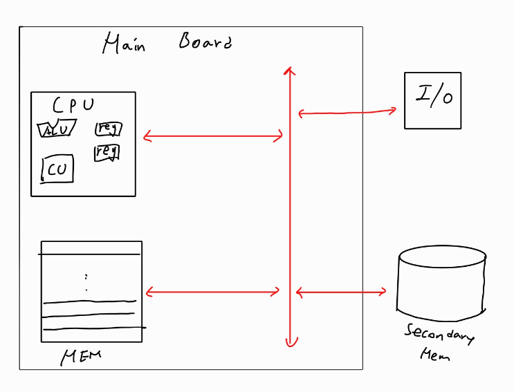

# 기본 컴퓨터 구조

## 1. 컴퓨터가 이해하는 정보

### 1) Data
- Data = 정보 덩어리
- 어떠한 값 혹은 자료

### 2) Instruction
- ⭐실제로 컴퓨터가 동작하기 위한 값
- 컴퓨터 = 명령을 처리하는 장치

> Data + Instruction = Program<br>
>  Data와 Instruction은 메모리에 저장된다

## 2. 컴퓨터의 4가지 핵심 부품
### 1) Main Memory
- ⭐현재 동작중인 프로그램을 저장하는 장치
(보조 기억장치와 차이 구분)
- 정보(data&명령어)를 저장할 때 주소체계를 이용
  - 메모리 동작속도를 빠르게 하기위해 Data와 Instruction을 체계적으로 정리해야함
  - 주소라는 개념을 이용하여 정리 및 저장함
- Main Memory는 보통 RAM을 지칭함
- ❗Volatile 특성을 지님
  - 전원이 꺼지면 데이터가 휘발됨

### 2) CPU(Central Processing Unit)
```
1) 명령어와 데이터를 **읽어서**
2) 명령어를 **해석하고**
3) 명령어를 **수행하는** 장치
```

#### ⭐CPU 구성요소⭐
1. ALU(Arithmetic Logic Unit)
    - 계산기
    - 연산하는 장치
    - Arithmetic: 산술 연산
    - Logic: 논리 연산
2. Register
    - 메모리에서 읽어온 데이터나 명령어를 **임시 저장**하는 장치
> ⭐⭐⭐ Register도 일종의 메모리임!
> > Register: 예약하다 --> **특수한 용도**가 정해진 메모리를 **Register**라고한다
> >> 그냥 메모리는 범용적인 역할이다<br>
> >> ❗단 Peripheral의 register는 CPU가 보기에 메모리와 다름없다
> >>> 그래서 CPU가 Peri의 register에 접근할 때 메모리 매핑으로 통해 접근한다(추후 다룰 내용)

3. Control Unit
    - **명령어 해석**하는 장치
    - **제어 신호**를 보내는 장치
        - READ: 메모리에서 데이터를 읽어옴
        - WRITE: 메모리에 데이터를 씀

### 3) Secondary Memory(보조기억장치)
- **보관할** 프로그램을 저장하는 장치
- **Non volatile**
    - 전원이 꺼져도 휘발되지 않음
- 가격이 비싸고 용량이 적은 Main memory 보조

### 4) I/O device
- 컴퓨터 외부에 연결되는 장치
- Peripheral
> ❗I/O Device는 **Interrup**라는 방식을 이용하여 CPU와 통신함

### 5) 그외
1. 메인보드
- 컴퓨터의 핵심부품들을 연결해주는 역할
- PCB 보드와 유사
2. System Bus
- Bus: 장치들이 정보를 주고받는 통로
- System Bus: 컴퓨터의 핵심부품들이 통신하는 버스를 말함
- ⭐Bus의 구성
    1) 주소 버스
    2) 데이터 버스
    3) 제어버스

> 혼공컴운 참고
