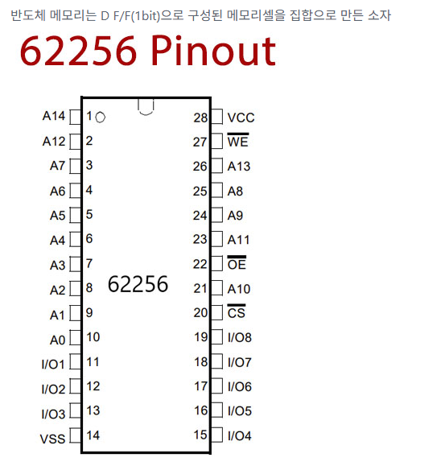
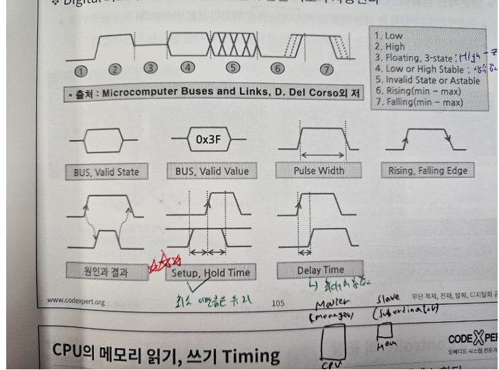
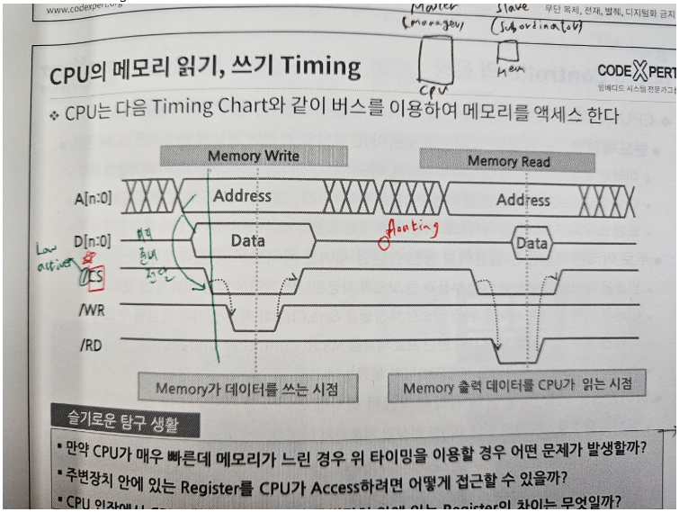

## 목차
- [1. 반도체 메모리 분석](#1-반도체-메모리-분석)
- [⭐⭐⭐2. 고전적인 CPU 메모리 버스](#2-고전적인-cpu-메모리-버스)
- [⭐3. 기본적인 Timing chart 이해](#3-기본적인-timing-chart-이해)
- [⭐⭐⭐4. Bus Address Decode의 역할](#4-bus-address-decode의-역할)

# 꼭 알고가야하는 메모리 지식
## 1. 반도체 메모리 분석
> 반도체 메모리는 D F/F(1bit)으로 구성된 메모리셀을 집합으로 만든 소자 

### 기본 지식(feat. 62256 RAM을 통한 이해)
- 핀 넘버링은 좌상단부터 U자형태를 그리며 순서대로 매겨진다
  - 그래서 회로 설계 도중 포트 넘버가 U1, U2로 정해지는 경우는 이러한 것을 반영한 것
- 주소의 line 수: A0~A14 --> A[14:0] 15bit
- 데이터의 비트 수: I/O1~I/O8 --> Data[7:0] 8bit
- 메모리 용량은? 

    - (2^15) * (1B) = 32KByte
> CPU는 메모리 주소를 1B 단위로 할당한다
- 62256 메모리의 표현가능한 주소 범위는?
  - 0x0000 ~ 0x7FFF
  - 만일 시작 주소가 0x1000번지라면 끝주소는? --> 0x8FFF번지
## 2. 고전적인 CPU 메모리 버스

> z80 processor의 Pinmap
- 고전적인 CPU는 메모리와 통신하기위해 메모리 버스를 갖는다
- 데이터 버스는 READ, WRITE가 모두 가능한 **양방향 버스**이다

### CPU <-> 메모리 간 통신을 위한 신호들
#### CPU(master)
- CS(Chip Select)
  - 하나의 CPU가 여러개의 메모리에 연결될 때, 접근할 메모리를 선택한다
  - 만일 CS가 없으면 공유하는 데이터버스에 의해 원치않는 Peri 혹은 메모리에 데이터를 쓰거나 읽게 된다
- RD: READ
- WR: WRITE
- D: Data Bus로 양방향 데이터 전달을 한다
- A: Address Bus
#### Memory(Slave)
- CE(Chip Enable)
  - Select된 Chip(메모리)이 Enable(활성화)됐음을 알린다
- OE(Output Enable)
  - READ 신호를 받아서 메모리의 내용을 Output할 준비가 되었음을 알린다
- WE(Write Enable)
  - WRITE 신호를 받아서 메모리에 데이터를 Write할 준비가 되었음을 알린다
> 나중에 다루겠지만 Z80에 "Wait" signal이 있는데 이는 메모리와 CPU간의 속도차를 해결하기 위해 만든 신호다(고전방식)

## 3. 기본적인 Timing chart 이해
> Timing chart는 spec sheet를 보거나 이해할 때 필요하므로 필수적으로 숙지해야한다

### 특별히 주의해서 볼 것
- Floating(혹은 High-Z)
  - 0인지 1인지 모름
  - 그러나 High 혹은 Low가 들어오면 그 값을 따라감
  - 보통 Bus나 메모리 초기화 시 High-Z 상태로 만들어준다
- ⭐⭐⭐Setup/Hold time
  - Setup time: 값을 정상적으로 캐치하기 위해 **clock edge 이전**에  input value가 유지되어야하는 **최소 시간**
  - Hold time: 값을 정상적으로 캐치하기 위해 **clock edge 이후**에 input value가 유지되어야하는 **최소 시간**
- Delay time
  - 최대로 허용되는 지연 시간

### 타이밍 차트를 통해 보는 실제 메모리 동작

#### Write case
- CS 신호가 도착하기 전에 미리 Write할 Data와 Address를 준비해놓아야 한다
- CS 신호가 도착하면 WRITE 신호를 보내 WRITE를 수행한다
- WRITE가 끝나면 다시 active high로 변경한다
- CS 신호를 active high로 원복한다

#### READ case
- CS 신호가 도착하기 전에 Data를 Read할 Address를 준비해놓는다
- CS 신호가 도착하면 READ 신호를 보내고, 메모리로부터 데이터를 읽어온다
- Data를 읽어왔으면 READ 신호를 다시 active high로 바꾼다
- CS 신호를 active high로 원복한다

#### ⭐고민해보자
#### Q.만일 CPU는 매우 빠른데 메모리가 느린 경우 문제 해결방법
    1) 고전 방법
        - Wait 신호를 이용해 속도차만큼 CPU를 멈춘다
        - CPU가 멈춘만큼 딜레이가 발생하여 동작 속도 면에서 손해를 봄
    2) 현대 방법
        - Handshaking 구조를 이용한다(AXI가 대표적)
        - CPU가 일방적으로 제어신호를 보내는 것이 아님
        - CPU가 제어신호를 보내고, 메모리가 준비됐다고 신호를 보내면 그 때 통신을 시작함

## 4. Bus Address Decode의 역할
> 반도체 설계를 위해 이건 기본으로 알고 가기!!
### 버스 컨트롤러의 주소 디코딩 역할
- 하나의 CPU에 대해 여러개의 Peri(그들의 메모리)가 연결됨
- 배정된 주소에 맞는 Chip select 신호를 보내야 함
- ❗버스 컨트롤러가 CPU에서 접근하려는 주소에 해당하는 CS 신호를 발생시킴
- ⭐SW(CPU)입장에서 Peripheral의 register도 메모리로 봄
  - 그래서 메모리 매핑 방식으로 주소에 접근함

### 기본 상식으로 알기
#### NAND Vs NOR 메모리
1) NAND 메모리
    - 공정 가격이 저렴함
    - 그래서 대용량 생산이 가능
    - HDD 대체품으로 등장
    - 그러나 불량섹터 가능성
    - 그래서 코드를 저장하는 메모리로는 사용할 수 없다
    - 보조 메모리로 이용용
2) NOR 메모리
    - 공정 가격이 비쌈
    - 소용량으로 생산
    - ❗불량섹터가 발생할 가능성이 전혀 없음❗
    - 그래서 코드를 저장하는 메모리로 사용
    - 주로 프로세서 내부의 ROM등에 이용
